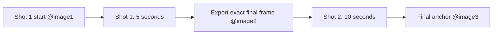

# Luca and the Footprints That Walk Ahead — Two-Shot Production Plan

## Scope

This is a 15-second vertical social short made from two separate generated clips. The clips are joined directly at a shared matching frame.

| Item | Decision |
|---|---|
| Shot 1 | 5 seconds; discovery of three forward footprints |
| Shot 2 | 10 seconds; backward test, dialogue and final hold |
| Final edit | 15 seconds total, direct cut at the shared frame |
| Format | 1080×1920, 9:16, 24 fps |
| Character | Approved Luca only |
| World | Little Forest — Discovery Path |
| Dialogue | “My footprints are getting ahead of me!” |
| Music | None |
| Total footprints | Exactly five |

## Canonical References

- Character identity: `01-CHARACTERS/drawings/luca.png`
- World reference: `POMPOM_HILLS_PRODUCTION/02_WORLDS/LITTLE_FOREST/01_HERO_VIEW/hero-view.png`
- Shot 1 start frame: `@image1`
- Shot 2 start frame: `@image2`, exported from the final frame of Shot 1
- Shot 2 final anchor: `@image3`, approved still showing five footprints and Luca's amused reaction
- Voice: the exact approved saved Luca voice asset; do not invent or substitute a voice ID

## Frame Dependency

`@image2` is not a newly generated approximation. It is the actual clean last frame of the rendered Shot 1 clip. Shot 2 must start from that frame so Luca, the three footprints and the environment do not jump at the edit point.

## Story Timing

### Shot 1 — Discovery, 5 seconds

| Time | Action | Footprints |
|---|---|---:|
| 00–01.25 | Luca completes forward step 1 | 1 |
| 01.25–02.50 | Luca completes forward step 2 | 2 |
| 02.50–03.75 | Luca completes forward step 3 | 3 |
| 03.75–05.00 | Luca stops and notices the trail; stable hold | 3 |

### Shot 2 — Test and reaction, 10 seconds

| Time | Action | Footprints |
|---|---|---:|
| 00–02.00 | Exact continuation from Shot 1; Luca observes | 3 |
| 02.00–03.75 | Luca takes backward step 1; new print appears ahead | 4 |
| 03.75–05.50 | Luca takes backward step 2; new print appears ahead | 5 |
| 05.50–06.75 | Luca stops and looks toward viewer | 5 |
| 06.75–09.00 | Luca says the exact dialogue once | 5 |
| 09.00–10.00 | Stable amused final hold | 5 |

## Assembly Rules

1. Render Shot 1 as a 5-second clip.
2. Export its clean final frame as `@image2`.
3. Render Shot 2 as a 10-second clip using `@image2` as its start frame.
4. Place Shot 2 immediately after Shot 1 at the shared visual frame.
5. Do not add a transition, dissolve, crossfade, speed ramp, zoom, sound bridge or camera effect.
6. If the editor repeats the identical boundary frame, remove only the duplicate frame; do not trim away the final stable state of Shot 1.
7. Keep the final output at 15 seconds, 1080×1920, 24 fps and 9:16.

## Audio Rules

- Shot 1: quiet Little Forest ambience, soft footsteps and three tiny footprint puffs.
- Shot 2: the same ambience, two tiny footprint puffs and Luca's approved voice line.
- Keep the ambience continuous and below the dialogue.
- No music, melody, song, chimes, narration, extra voices or automatic sound additions.

## Final-Frame Requirements

The final second of Shot 2 must be stable. `@image3` must preserve:

- full-body Luca inside the centre 60% safe area;
- the same camera and Little Forest layout;
- exactly five visible footprints in one forward trail;
- Luca stopped, grounded and wearing the approved clothing;
- a small amused expression;
- no text, subtitles, logos or watermark.

## QA Checklist

- [ ] Shot 1 is exactly 5 seconds.
- [ ] Shot 2 is exactly 10 seconds.
- [ ] Final edit is exactly 15 seconds.
- [ ] Shot 2 starts from the exact exported final frame of Shot 1.
- [ ] Three footprints appear in Shot 1 and two in Shot 2.
- [ ] There are exactly five footprints in the final frame.
- [ ] No footprints appear behind Luca or before a step completes.
- [ ] Luca's identity, clothing, scale, voice and safe-area position remain stable.
- [ ] Little Forest remains fixed and recognisable.
- [ ] Dialogue is spoken once and lip sync is accurate.
- [ ] Final second is stable and matches the approved final anchor.
- [ ] No music, text, subtitles, logo, watermark or unwanted character appears.
